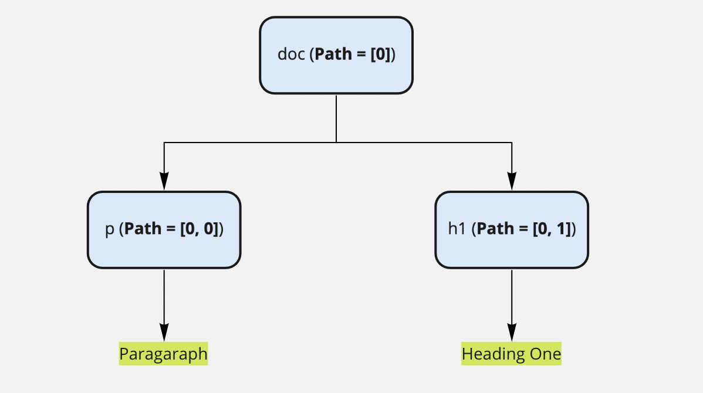

# Contentstack JSON RTE Plugins SDK API Reference

This document describes the API requests that a JSON RTE plugin can use to communicate with Contentstack.
 
+ [Prerequisites](#prerequisites)
+ [Inclusion in your project](#inclusion-in-your-project)
+ [Classes](#classes)
+ [Editor Events](#editor-events)
+ [Dropdown plugin](#dropdown-plugin)

<span id='#prerequisites'/>

## Prerequisites


* Basic understanding of JSON Rich Text Editor
* JSON structure and terminology associated with it


## Structure of JSON Rich Text Editor


```json
{
  "type": "doc",
  "children": [
    {
      "type": "p",
      "children": [
        {
          "text": "Paragraph"
        }
      ]
    },
    {
      "type": "h1",
      "children": [
        {
          "text": "Heading One"
        }
      ]
    }
  ]
}
```


In the JSON Rich Text Editor, the JSON structure is represented as a **Node** which consists of two types:


1. Block Node
2. Leaf Node

The editor content that is inside a Node of type doc acts as a root for the content. Where a Block node is a JSON structure with a “children” key in it. Whereas a Leaf node will just have “text” which may include formatting properties (mark) like “bold”, “italic”, etc. 

 \
**Mark:** You'll see a mark used in below example which is nothing but a leaf property on how to render content. \
For example,


```json
{ 
  "text": "I am Bold", 
  "bold": true 
} 
```


Here, bold is the mark or the formatting to be applied to the "I am Bold" text.


### Render Type

A Block node can be rendered in three different ways as follow:


1. Block
2. Inline 
3. Void 


### Path

Path arrays are a list of indexes that describe a node's exact position.




In JSON Rich Text Editor, a Path has the following structure: 


```javascript
Number[]
```

For example, path for doc is [0], paragraph is [0,0] from the above given example.


### Point

Point objects refer to a specific location of text in the leaf node. Its path refers to the location of the node in the tree, and its offset refers to distance into the node's string of text. 


In the JSON Rich Text Editor, a Point has the following structure:


```javascript
Point = { 
    path: Path, 
    offset: Number 
}
```


### Range

A Range is a set of two points called `anchor (start)` and `focus (end)` specifying start and end of range in a JSON document.


The structure of a Range is as follows:


```javascript
Range = { 
    anchor: Point, 
    focus: Point 
}
```


### Location

Location is one of the ways to specify the location in a JSON document.  It could be a Path, Point, or Range.

<span id='#prerequisites'/>

## Inclusion in your project

For JSON RTE Plugins, you will need to install `@contentstack/app-sdk` in your react project. You will also need to clone the [boilerplate](https://github.com/Deepak-Kharah/contentstack-rte-plugin-boilerplate) GitHub repository that contains the template needed to create a JSON RTE plugin.

<span id='#classes'/>

## Classes

### `RTEPlugin(plugin_id, configCallback)`

This method allows you to create a JSON RTE plugin instance for the JSON Rich Text Editor field.

**Kind:** instance property of JSON RTE plugin

**Returns** : Object - Plugin Object

| **Parameter**    | **Type**                    | **Description**                                                                                                                                                                           |
| ---------------- | --------------------------- | ----------------------------------------------------------------------------------------------------------------------------------------------------------------------------------------- |
| `plugin_id`      | string                      | Unique ID of the plugin                                                                                                                                                                   |
| `configCallback` | (rte: IRteParam) => IConfig | This function receives an [RTE instance](#rte) as argument and it expects you to return a [config object](#config-object) that includes details like title, icon, render, etc. |

<span id='config-object'></span>

### `configCallback: (rte) => IConfig`

**IConfig** : This user defined object will have all the essential metadata for the plugin.

The following table contains possible properties of IConfig: 

| **Key**       | **Type**  | **Description**                                                  |
| ------------- | --------- | ---------------------------------------------------------------- |
| `title`       | string    | Identifier for the toolbar button                                |
| `icon`        | ReactNode | Icon which will be used for buttons                              |
| `display`     | (‘toolbar’ \| ‘hoveringToolbar’)[]  | Location of the plugin                  |
| `elementType` | (‘inline’ \| ‘void’ \| ‘block’)[]  | Render type                               |
| `render`      | ReactNode | Component to be rendered within the editor when corresponding plugin_uid appears in json.   |

<span id="rte">**rte**</span> : An instance which has all the essential functions required to interact with the JSON RTE.

Following are a list of helpful properties and methods of the JSON RTE instance.

### Properties:

**rte.ref :** Returns the HTML reference of the JSON RTE.

**rte.fieldConfig** : Contains metadata about the JSON RTE field which can be specified in the content type builder page.

| **Key**          | **Description**                 | **Type**                   |
| ---------------- | ------------------------------- | -------------------------- |
| `rich_text_type` | Type of JSON RTE                | 'basic' \| 'advance' \| 'custom' |
| `reference_to`   | List of content type uid used in JSON RTE references. | string[]                   |
| `options`        | Array of selected toolbar buttons  ( available if rich_text_type is ‘custom’ )                   | string[]                     |
| `title`          | Title of the field              | string                     |
| `uid`            | Unique ID for the field         | string                     |

### `rte.getConfig: () => Object`

Provides configuration which is defined while creating the plugin or while selecting a plugin in the content type builder page.

For example, if your plugin requires API Key or any other config parameters then, you can specify these configurations while creating a new plugin or you can specify field specific configurations from the content type builder page while selecting the plugin. These configurations can be accessed through the ```getConfig() ```method.


### RTE Methods:
These methods are part of the RTE instance and can be accessed as rte.methodName().

| **Method**       | **Description**                          | **Type**                                            |
| ------------------ | ---------------------------------------- | --------------------------------------------------- |
| `getPath`          | Retrieves the path of the node           | (node:Node) => Path                                 |
| `setAttrs`         | Sets attributes for the node.  <br/> For Eg: These attributes can be <br/> href for anchor plugin <br/>width, src for image plugin.             | (attrs:Object, options:Option) => void </br>  Option: [NodeOptions](#node-options)      |
| `isNodeOfType`     | Retrieves a boolean value, whether the node at the current selection is of input type       | (type:string) => boolean                               |
| `getNode`          | Retrieves node at given location       | (location:Location) => Node                         |
| `getNodes`         | Retrieves a [generator](https://developer.mozilla.org/en-US/docs/Web/JavaScript/Reference/Global_Objects/Generator) of nodes which includes the location specified in options `at` default at current selection   | (options:Option) => Node[] </br>  Option: [NodeOptions](#node-options)                         |
| `string`           | String value of JSON in given path       | (location:Location) => string                       |
| `addMark`          | Adds mark to the text                    | (key:string, val:any) => void                       |
| `removeMark`       | Removes mark from the text               | (key:string) => void                                |
| `hasMark`          | Checks if the selected text has a mark   | (key:string) => boolean                             |
| `insertText`       | Inserts text at a given location         | (text:string, location: Location) => void           |
| `getText`          | Gets text from a given location          | () => string                                        |
| `deleteText`       | Deletes text from selected range         | () => void                                          |
| `updateNode`       | Updates nodes based on provided options             | (type:string,attrs:Object, options: Option) => void </br>  Option: [NodeOptions](#node-options) |
| `unsetNode`        | Converts a node to a normal paragraph based on provided options    | (options: Option) => void </br>  Option: [NodeOptions](#node-options)                        |
| `insertNode`       | Inserts a node at a given location. Having ```select``` option true will select the node after insertion       | (node:Node, options?: Option) => void </br>  Option: [NodeOptions](#node-options)``` & { select?: boolean }```             |
| `deleteNode`       | Deletes a node at a given location       | (options: Option) => void </br>  Option: ```{at?: Location, distance?: number, unit?: 'character' \| 'word' \| 'line' \| 'block'} ```                  |
| `wrapNode`         | Wraps node based on provided options with given node     | (node:Node, options: Option) => void </br>  Option: [NodeOptions](#node-options)              |
| `unWrapNode`       | Unwraps node based on provided options  from the parent node      | (options: Option) => void </br>  Option: [NodeOptions](#node-options)                       |
| `mergeNodes`       | Merges nodes based on provided options        | (options: Option) => void </br>  Option: [NodeOptions](#node-options)                        |
| `getEmbeddedItems` | Gets details of embedded items JSON RTE. | () => Object                                        |
| `getVariable`      | Gets local variable                      | (name: string) => any                               |
| `setVariable`      | Sets a local variable                    | (name: string, val:any) => void                     |

**rte.selection:** Contains a set of functions to perform selection related tasks.

| **Function**   | **Description**                                           | **Type**                                          |
| -------------- | --------------------------------------------------------- | ------------------------------------------------- |
| `get`          | Retrieves current selection                               | () => Range                                   |
| `set`          | Sets the selection to a given location                    | (location: Location) => void                      |
| `isSelected`   | It is a React hook which returns ```true``` when the current node is selected.            | () => boolean                                     |
| `isFocused`    | It is React hook which returns ```true``` when the current node is focused             | () => boolean                                     |
| `getEnd`       | Retrieves the end location of the editor                  | () => Path                                        |
| `before`       | Retrieves the prior location before current selection     | (location: Location, options: Option) => Location </br>  Option: ```{distance?: number, unit?: 'offset' \| 'character' \| 'word' \| 'line' \| 'block'}``` |
| `after`        | Retrieves the subsequent location after current selection | (location: Location, options: Option) => Location </br>  Option: ```{distance?: number, unit?: 'offset' \| 'character' \| 'word' \| 'line' \| 'block'}```|
| `isPointEqual` | Checks if two points are equal                            | (point1: Point, point2: Point) => boolean         |

<span id='node-options' />

### Node Options:

Functions which involve transformation or change have an `options` parameter which includes options specific to transform and general `NodeOptions` to specify which Nodes in the document the transform function is applied to.


```json
interface NodeOptions {
  at?: Location
  match?: (node: Node, path: Location) => boolean
}
```


* The `at `option selects a `Location `in the editor. It defaults to the user's current selection
* The `match `option filters the set of Nodes with a custom function.
### Events function

| **Function** | **Description**                | **Arguments** |
| ------------ | ------------------------------ | ------------- |
| `isFocused`  | Check if the editor is focused | () => boolean |
| `focus`      | Focuses the editor             | () => boolean |
| `blur`       | Blurs the editor               | () => boolean |

## Plugin:

<span id='#editor-events'/>

## Editor Events

### `Plugin.on: (event_type, callback) => void`

| **event_type**   | **Description**                            | **Callback Arguments**                                                                                    |
| ---------------- | ------------------------------------------ | --------------------------------------------------------------------------------------------------------- |
| `keydown`        | When keydown is performed                  | ({event: KeyboardEvent, rte: RTE}) => void                                                                |
| `exec`           | When a button is clicked or triggered      | (rte: RTE) => void                                                                                        |
| `deleteBackward` | When backward deletion occurs              | ({rte: RTE, preventDefault: Function, ...args:[unit:"character" \| "word" \| "line" \| "block"]}) => void |
| `deleteForward`  | When forward deletion occurs               | ({rte: RTE, preventDefault: Function, ...args:[unit:"character" \| "word" \| "line" \| "block"]}) => void |
| `normalize`      | It is used to normalize any dirty ( unwanted structure ) objects in the editor | ({rte: RTE, preventDefault: Function, ...args:[[node:Node, path:Path]]}) => void                          |
| `insertText`     | Inserts text in the current selection      | ({rte: RTE, preventDefault: Function, ...args:[string]}) => void                                          |
| `change`         | When there is a change in the editor       | ({rte: RTE, , preventDefault: Function}) => void                                                          |
| `insertBreak`    | When the enter key is pressed              | ({rte: RTE, preventDefault: Function}) => void                                                            |

<span id='#dropdown-plugin'/>

## Dropdown plugin

### Plugin.addPlugins: (...Plugin) => void

The addPlugins method can help you to group the plugins under a dropdown that share the same theme. Also, the addPlugins method takes a list of plugins as an input. 

For example, the code for addPlugins is as follows:


```javascript
const ChooseAsset = RTE("choose-asset",  () => { /** Choose Asset Code   */ });
const UploadAsset = RTE("upload-asset",  () => { /** Upload Asset Code   */ });
const Asset = RTE("asset-picker", () => { /** Asset Picker Code */ });
Asset.addPlugins(ChooseAsset, UploadAsset);
```

