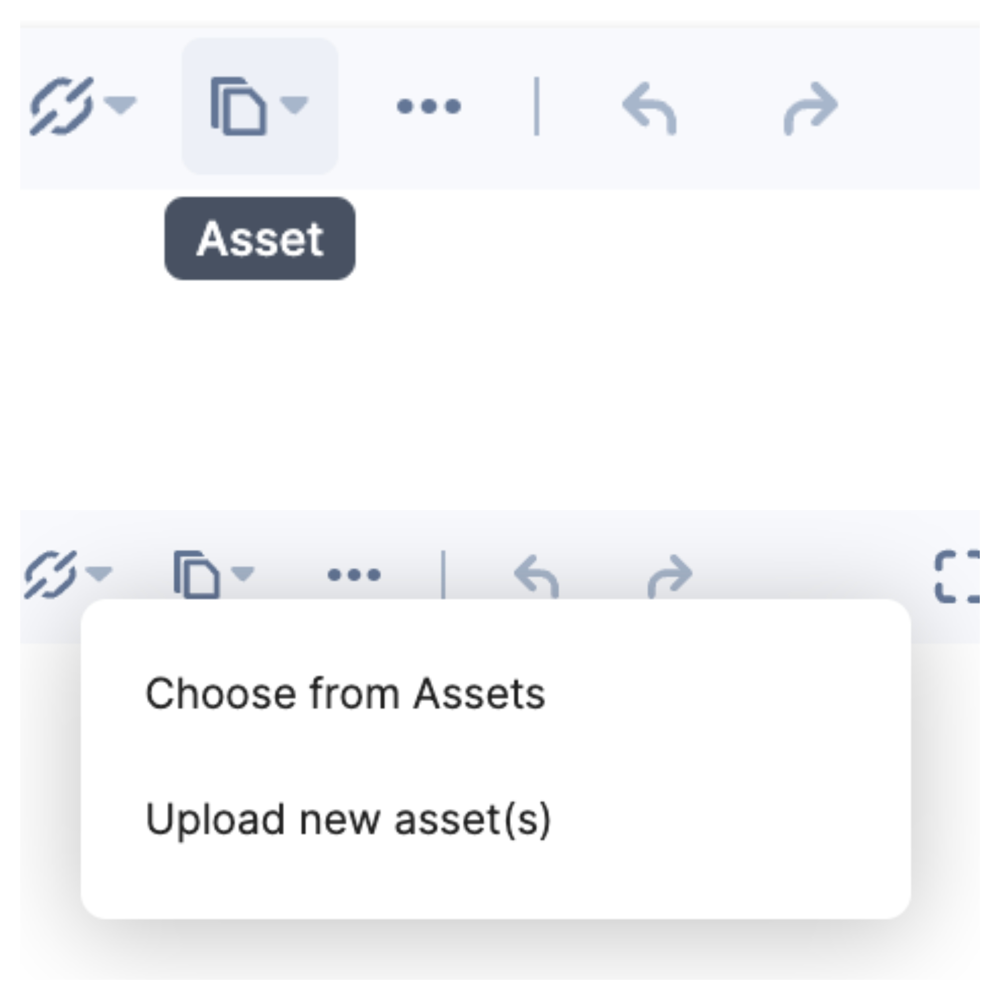

### Create Dropdown Plugin
#### addPlugin
```ts
Plugin.addPlugins(...Plugin) => void
```
The `addPlugins` method can help you group the plugins under a dropdown that share the same theme. Also, this method takes a list of plugins as input. 


For example, the code for `addPlugins` is as follows:
!!! example
    
```ts hl_lines="11"
// Child Plugin 1
const ChooseAsset = RTE("choose-asset",  () => { /** Choose Asset Code   */ });

// Child Plugin 2
const UploadAsset = RTE("upload-asset",  () => { /** Upload Asset Code   */ });

// Parent Dropdown Plugin
const Asset = RTE("asset-picker", () => { /** Asset Picker Code */ });

// Adding Child under Parent
Asset.addPlugins(ChooseAsset, UploadAsset);
```

