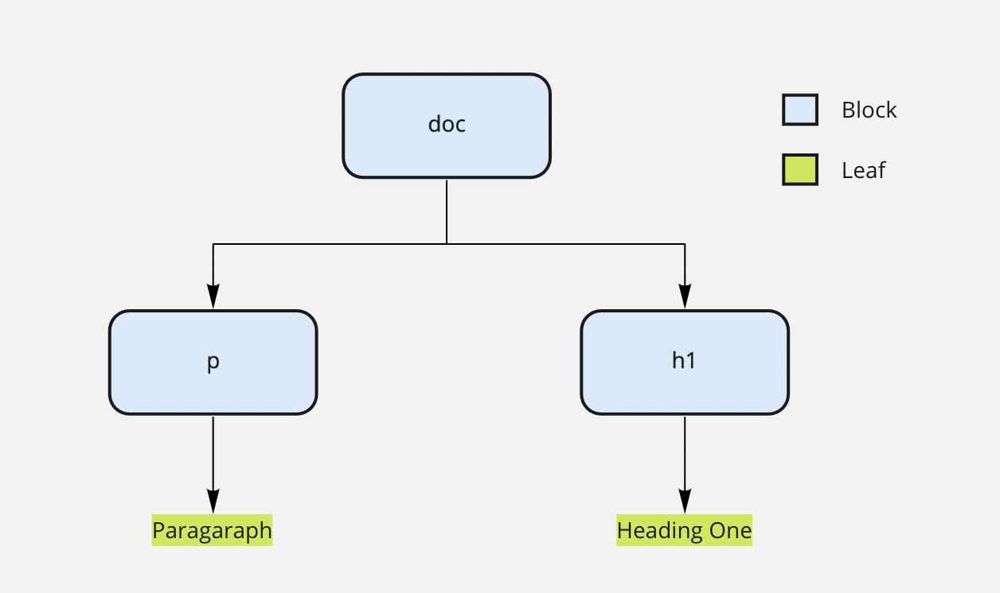
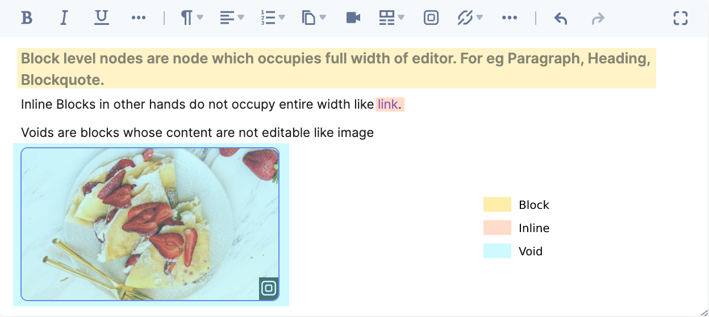
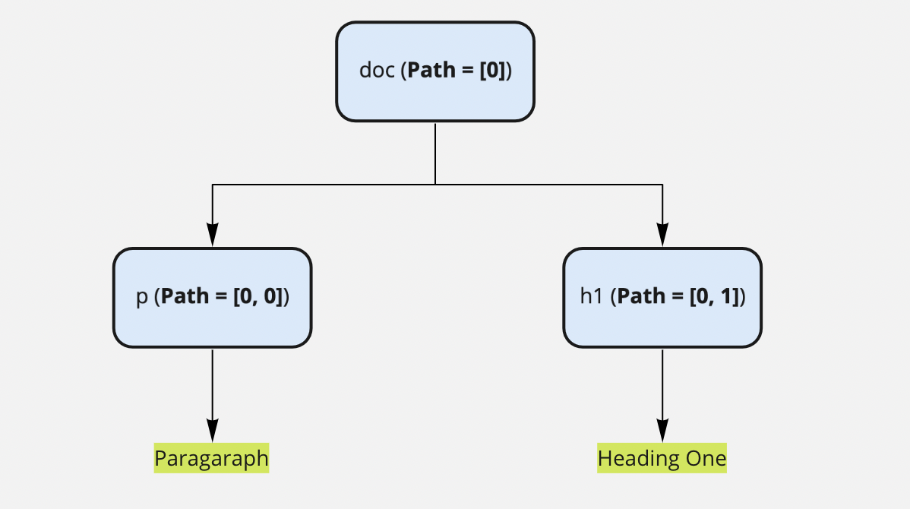
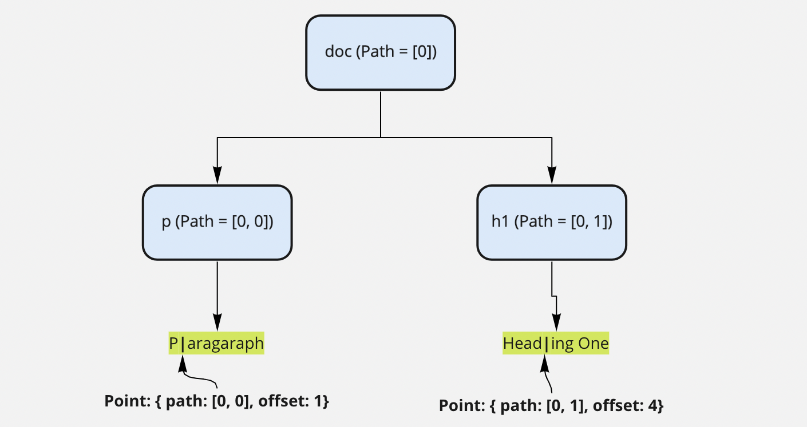
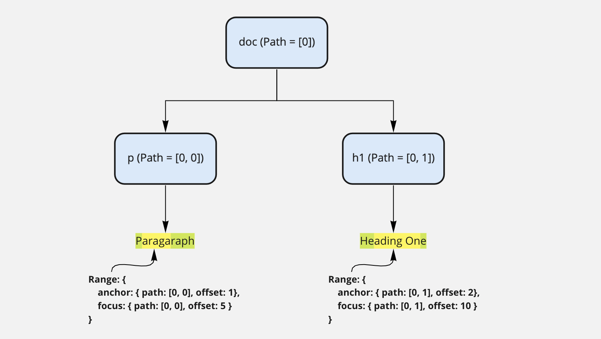

### Content
* Basic understanding of [JSON Rich Text Editor](https://www.contentstack.com/docs/developers/json-rich-text-editor/about-json-rich-text-editor/)
* JSON structure and terminology associated with it


### Structure of JSON RTE


```json
{
  "type": "doc",
  "children": [
    {
      "type": "p",
      "children": [
        {
          "text": "Paragraph",
          "bold": true
        }
      ]
    },
    {
      "type": "h1",
      "children": [
        {
          "text": "Heading One"
        }
      ]
    }
  ]
}
```


In the JSON Rich Text Editor, the JSON structure is represented as a **Node** which consists of two types:

1. Block Node
2. Leaf Node

The editor content inside a Node of type doc acts as a root for the content, whereas a Block node is a JSON structure with a “children” key. At the same time, a Leaf node will have “text” which may include formatting properties (mark) like “bold”, “italic”, etc. 

----
!!! note

    **Mark:** You'll see a mark used in below example, which is nothing but a leaf property on how to render content.

For example,
```json
{ 
  "text": "I am Bold", 
  "bold": true 
} 
```

Here, bold is the mark or the formatting applied to the "I am Bold" text.

----




### Render Type

A Block node can be rendered in three different ways as follow:


1. Block
2. Inline 
3. Void 




### Path

Path arrays are a list of indexes that describe a node's exact position.




In JSON Rich Text Editor, a Path has the following structure: 


```javascript
Number[]
```

For example, path for doc is [0], paragraph is [0,0] from the above given example.


### Point

Point objects refer to a specific location of text in the leaf node. Its path refers to the node's location in the tree, and its offset refers to distance into the node's string of text. 





In the JSON Rich Text Editor, a Point has the following structure:


```javascript
Point = { 
    path: Path, 
    offset: Number 
}
```


### Range

A Range is a set of two points called `anchor (start)` and `focus (end)` specifying start and end of the range in a JSON document.





The structure of a Range is as follows:


```javascript
Range = { 
    anchor: Point, 
    focus: Point 
}
```


### Location

Location is one of the ways to specify the location in a JSON document.  It could be a Path, Point, or Range.

```ts
Location = Path | Point | Range
```